Statement: [Twelve coins]().

This puzzle is more difficult than the [Twelve marbles]()
puzzle so it requires additional notation. Each weighing can have one of three
results: the scale leans to the left (**L**), the scale leans to the right
(**R**), or the scale stays even (**E**). Three weighings with three possible
results each creates a tree of 3³ = 27 total possibilities:

An answer to this puzzle includes a weighing for each of the 13 times the tree
of possibilities above branches. An answer is valid if, for all 27 leaves of the
tree, we know which coin is fake and whether it is lighter or heavier than the
real coins.

Let's get started.

## The first weighing

We begin with no information about any of the individual coins' weights.

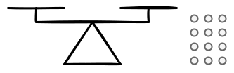

If we compare two groups of coins, the scale will tell us which group is
heavier. We can start by comparing four of the coins to four others, with the
remaining four to the side:

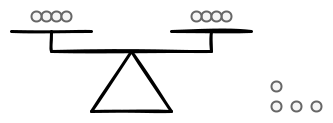

If the fake coin is off the scale, then it will stay even. If the fake coin is
on the scale, then it will lean to one side, either left or right. So we have
three cases:

|              **L**              |              **E**              |              **R**              |
| :-----------------------------: | :-----------------------------: | :-----------------------------: |
| 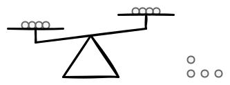 | 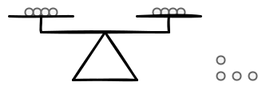 | 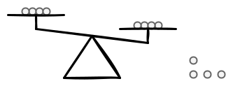 |

## Solving case **E**

**E** is the simplest case to solve, so let's analyse it first. The scale stays
even so all coins on it must be real. We can rule them out as suspects:

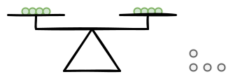

For our second weighing, let's compare three of the remaining suspects with
three coins that we know are real:

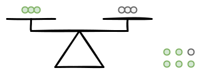

Again, there are three possibilities:

|              **EL**              |              **EE**              |              **ER**              |
| :------------------------------: | :------------------------------: | :------------------------------: |
| 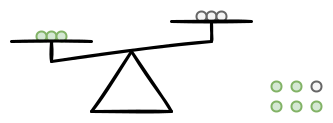 | 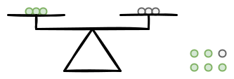 | 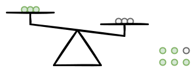 |

### Solving case **EL**

Let's start with case **EL**. Since the scale leaned to one side, there must be
a fake coin on the scale. We can rule out the coin left off the scale: it must
be real. We also know that the fake coin must be lighter than real coins;
otherwise, the scale would have leaned the other way. So each of the three
remaining suspects is either real or lighter, but cannot be heavier:

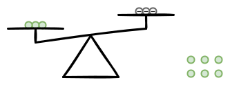

Because of this symmetry, solving the **EL** case also solves the **ER** case.

To solve the **EL** case, we compare one suspect to another, with the third
suspect off the scale:

Again, there are three possibilities:

|              **ELL**              |              **ELE**              |              **ELR**              |
| :-------------------------------: | :-------------------------------: | :-------------------------------: |
| 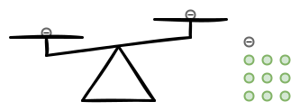 | 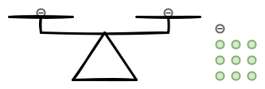 | 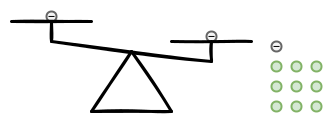 |

Let's start with case **ELL**. The scale leaned to one side so we know that the
fake coin is on the scale. In the previous weighing, we ruled out the
possibility of the fake coin being heavier than real coins. This means that the
lighter coin must be the fake coin:

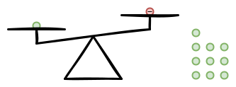

Symetrically, for case **ELR** the lighter coin must be the fake coin:

For case **ELE**, the fake coin cannot be on the scale. So the coin left off the
scale must be fake, and we know it is lighter:

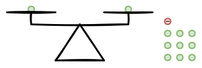

That solves case **EL** entirely.

### Solving case **ER**

Cases **EL** and **ER** are symmetrical. This is case **EL**:

And this is case **ER**:

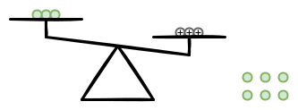

Because of this symettry, the method to solve case **EL**, when mirrored, also
solves case **ER**.

### Solving case **EE**

Case **EE** was this result to the second weighing:

Since the scale stays even, all coins on it must be real. By elimination, the
fake coin must be the suspect we left off the scale:

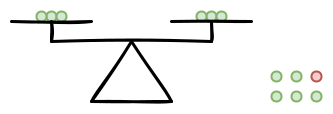

We use the third weighing to determine whether the fake coin is lighter or
heavier than a real coin:

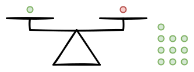

The scale cannot stay even with the fake coin on it, so case **EEE** is not
possible. That leaves case **EEL**:

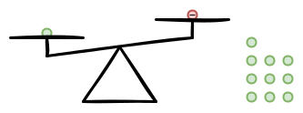

And case **EER**:

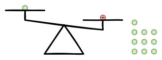

In both cases, we know wether the fake coin is lighter or heavier than real
coins. This solves case **EE** and, since we solved cases **EL** and **ER**
previously, all of case **E**.

## Solving case **L**

Case **L** was this result for the first weighing:

The scale leaned to one side, so the fake coin must be on it. If the fake coin
is on the left, then it must be heavier. If the fake coin is on the right, then
it must be lighter:

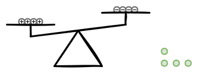

In order to obtain as much information as possible from the **LL**, **LE**, and
**LR** cases, we compare a mix of real coins, potentially lighter coins, and
potentially heavier coins:

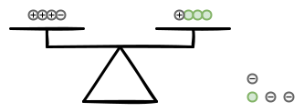

There are three possible results:

|              **LL**              |              **LE**              |              **LR**              |
| :------------------------------: | :------------------------------: | :------------------------------: |
| 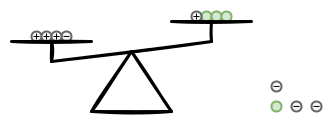 | 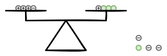 | 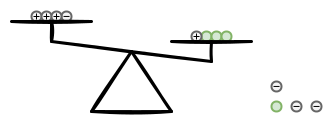 |

### Solving case **LL**

Let's start with case **LL**. Since the scale leans to the left, we know the
left side is heavier than the right side. The fake coin must be on the scale, so
we can rule out all coins off the scale as suspects.

The coin tagged `+` on the right side cannot be responsible: the previous
weighing ruled out the possibility of it being lighter than a real coin.
Similarly, the coin tagged `-` on the left side cannot be reponsible: we already
ruled out the possibility of it being heavier than a real. So we know that both
of these coins are real:

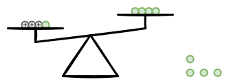

This is equivalent to case **ER** and case **EL**. We solve case **LL** in the
exact same way.

### Solving case **LR**

Case **LR** was this result to the second weighing:

The scale leans to the right, so the right side is heavier than the left side.
The fake coin must be on the scale, so we can rule out all coins off the scale
as suspects.

The coins tagged `+` on the left side cannot be responsible: the previous
weighing ruled out the possibility of them being lighter than real coins. The
only suspects that remain are the coin tagged `-` on the left and the coin
tagged `+` on the right:

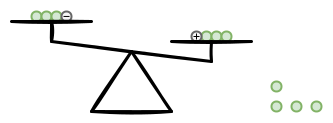

We compare one of these coins to a real one:

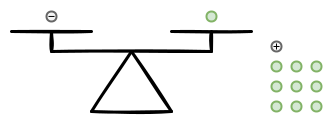

The scale cannot lean to the left, since we know the coin on the left side
cannot be heavier than a real coin. That leaves two possible outcomes:

|              **LRE**              |              **LRR**              |
| :-------------------------------: | :-------------------------------: |
| 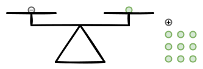 | 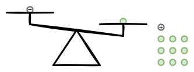 |

In case **LRE**, the scale stays even so we know all coins on it are real. By
elimination, the remaining suspect must be the fake coin and we know it is
heavier than a real coin:

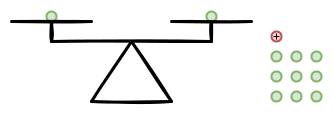

In case **LRR**, the only suspect on the scale must be the fake coin and we know
it is lighter than a real coin:

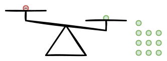

That concludes the **LR** case.

### Solving case **LE**

Case **LE** was this result for the second weighing:

The scale stays even so we know all coins on it are real:

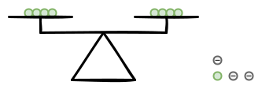

This is equivalent to case **EL**. We solve case **LE** in the exact same way.

This solves case **L** entirely.

## Solving case **R**

Cases **L** and **R** are symmetrical: both are solved in the same way, only
mirrored. So we have already solved case **R**.

With cases **L**, **E**, and **R** all solved, we have solved the puzzle.
