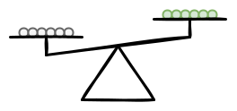

Statement: [Twelve coins]().

We begin with no information about any of the individual coins' weights.

If we compare two groups of coins, the scale will tell us which group is
heavier. We can start by comparing half of the coins to the other half:

One of the groups must contain the fake coin, which is heavier, so the scale
must lean to one side:

The heavier group must contain the fake coin and the lighter group must
contain only real coins. We can rule out the lighter group as suspects:

The fake coin must be among the six coins that remain. Lets split those into
two groups and compare them:

Again, one of the groups must contain the fake coin, so the scale must lean to
one side:

This allows us to rule out three more coins as being definitely real:

With three suspects left, we can compare one to another, with the third off the
scale:

If the fake coin is on the scale, then it will lean to one side. If the fake
coin is off the scale, then it will stay even. So we have two possible results:

Or:

If the scale leans, then we know the heavier coin is the fake one:

If the scale stays even, then both coins on it have the same weight, which is
only possible if both are real. By elimination, the fake coin must be the one we
put aside:

Either way, we found the fake coin using the scale only three times.
