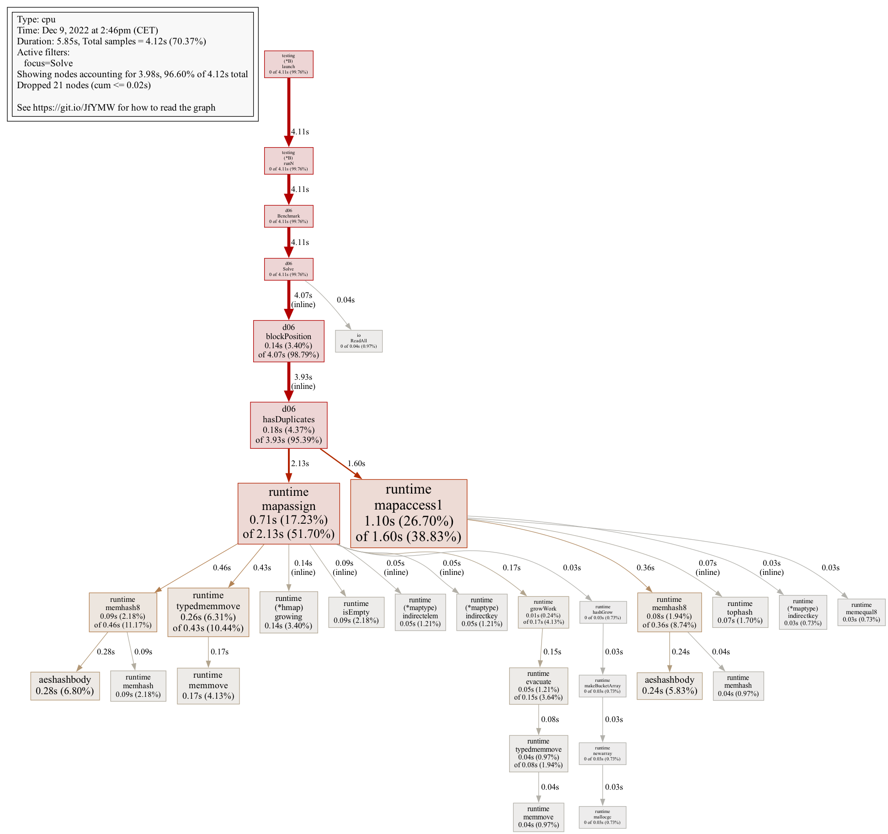
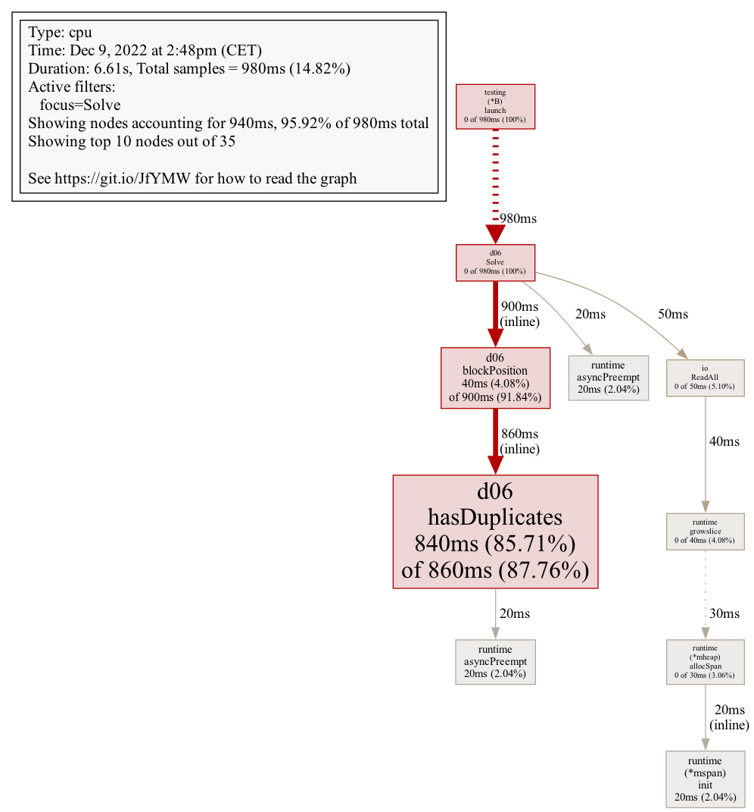

The [Advent of Code](https://adventofcode.com/) is an annual set of coding
puzzles. I find [today's puzzle](https://adventofcode.com/2022/day/6)
interesting because it's a good example of how sometimes better memory
management can make a real difference in performance.

A friend and I are both doing the Advent of Code in Go this year, and we
sometimes compare solutions. We tend to favor simplicity and readability over
performance, but if we can make our code run much faster without adding a lot of
complexity, we usually like to.

The puzzle isn't very complicated. You are given a stream of bytes. Find the
first consecutive block of 14 bytes where all 14 of these bytes are different.
Return the position of that block in the stream.

## Writing a benchmark

Every participant's puzzle input is different, so I'll be using mine for this
article. Here is [a link to it](code/testdata/input.txt) if you want to download
it. The answer for this input is 3613 (the block is `fgspbvtdjrwznc`).

Let's write a minimalist solution:

```go
// solution.go
package d06

import (
	"fmt"
	"io"
)

func Solve(r io.Reader, w io.Writer) error {
	_, err := fmt.Fprint(w, "3613")
	return err
}
```

Obviously this is cheating: I already know the answer. But this is just to
setup a benchmark and measure performance. Let's add a unit test and a
benchmark:

```go
// solution_test.go
package d06

import (
	"bytes"
	"io"
	"log"
	"os"
	"testing"
)

func Example() {
	file, err := os.Open("testdata/input.txt")
	if err != nil {
		log.Fatalf("could not open input file: %v", err)
	}
	defer file.Close()

	if err := Solve(file, os.Stdout); err != nil {
		log.Fatalf("could not solve: %v", err)
	}
	// Output: 3613
}

func Benchmark(b *testing.B) {
	input, err := os.ReadFile("testdata/input.txt")
	if err != nil {
		b.Fatalf("could not read input file: %v", err)
	}

	r := bytes.NewReader(input)
	w := io.Discard

	for n := 0; n < b.N; n++ {
		r.Reset(input)
		_ = Solve(r, w)
	}
}
```

Now we can confirm that our solution provides the correct answer and measure its
performance:

```terminal
$ go test -bench=. -cpu=1,2,4,8 -benchmem

goos: darwin
goarch: arm64
pkg: github.com/busser/adventofcode/y2022/d06
Benchmark     	53504293	        22.37 ns/op	       0 B/op	       0 allocs/op
Benchmark-2   	53038576	        22.36 ns/op	       0 B/op	       0 allocs/op
Benchmark-4   	52894310	        22.38 ns/op	       0 B/op	       0 allocs/op
Benchmark-8   	52344886	        22.37 ns/op	       0 B/op	       0 allocs/op
PASS
ok  	github.com/busser/adventofcode/y2022/d06	5.920s
```

Here's how to interpret the benchmark results above:

- We ran 4 benchmarks:
  - `Benchmark` used a single CPU core
  - `Benchmark-2` used 2 CPU cores
  - `Benchmark-4` used 4 CPU cores
  - `Benchmark-8` used 8 CPU cores
- Each benchmark called the `Solve` function about 50 million times in order to
  measure its performance.
- The `Solve` function runs in about 22 nanoseconds on average.
- The `Solve` function uses 0 bytes of heap memory on average.
- The `Solve` function makes 0 heap memory allocations on average.

## Simple, intuitive solution

Now let's write an actual solution. The steps our solution takes are:

1. Read the stream of bytes and store it in a slice.
2. Move along the datastream, checking each block of 14 bytes.
3. Check if a block has duplicates by keeping track of past bytes with a map.

Our solution now looks like this:

```go
package d06

import (
	"errors"
	"fmt"
	"io"
)

func Solve(r io.Reader, w io.Writer) error {
	datastream, err := io.ReadAll(r)
	if err != nil {
		return fmt.Errorf("could not read input: %w", err)
	}

	position, err := blockPosition(datastream, 14)
	if err != nil {
		return err
	}

	_, err = fmt.Fprintf(w, "%d", position)
	return err
}

func blockPosition(datastream []byte, size int) (int, error) {
	for i := 0; i < len(datastream)-size; i++ {
		if !hasDuplicates(datastream[i : i+size]) {
			return i + size, nil
		}
	}

	return 0, errors.New("not found")
}

func hasDuplicates(block []byte) bool {
	seen := make(map[byte]bool)

	for _, b := range block {
		if seen[b] {
			return true
		}
		seen[b] = true
	}

	return false
}
```

This solution works and solved the puzzle for me. But then I ran a benchmark to
see if I could do any better.

### Performance analysis

Running our benchmark gives us a pretty good idea of how fast the solution is:

```terminal
$ go test -bench=. -cpu=1,2,4,8 -benchmem

goos: darwin
goarch: arm64
pkg: github.com/busser/adventofcode/y2022/d06
Benchmark     	    2820	    361775 ns/op	   27813 B/op	     179 allocs/op
Benchmark-2   	    3300	    360844 ns/op	   27811 B/op	     179 allocs/op
Benchmark-4   	    3280	    363004 ns/op	   27814 B/op	     179 allocs/op
Benchmark-8   	    3306	    362023 ns/op	   27819 B/op	     179 allocs/op
PASS
ok  	github.com/busser/adventofcode/y2022/d06	4.847s
```

Here's what we see:

- The `Solve` function runs in about 0.36 milliseconds on average.
- The `Solve` function uses about 28 kilobytes of memory on average.
- The `Solve` function makes 179 allocations on the heap on average.

If there is a simple way to make my code faster, I want to know about it.
Go has built-in profiling tools to help me with this. I can use the
`-cpuprofile` flag to measure my program's CPU usage in detail:

```terminal
$ go test -bench=. -cpu=1,2,4,8 -benchmem -cpuprofile=cpu.out
```

And use `go tool pprof` to produce a graphical visualisation of the profile:

```terminal
$ go tool pprof -focus=Solve -call_tree -relative_percentages -png -output=cpu.png cpu.out

Generating report in cpu.png
```



We can instantly see that our solution spends most of its time reading writing
to a map inside the `hasDuplicates` function. Let's try to find a faster
alternative to a map.

## Replacing the map with a slice

The `hasDuplicates` function needs to keep track of bytes it has seen before in
the block it was passed. Byte values go from 0 to 255, so we can replace a map
of bytes to booleans with a slice of 256 booleans, like this:

```go
func hasDuplicates(block []byte) bool {
    // seen := make(map[byte]bool)
    seen := make([]bool, 256)

    for _, b := range block {
        if seen[b] {
            return true
        }
        seen[b] = true
    }

    return false
}
```

This is only a one-line change and it doesn't make the code more complicated. It
only works because we know that byte values have a small range, but we might as
well take advantage of that.

### Performance analysis

Running our benchmark again yields great results:

```terminal
$ go test -bench=. -cpu=1,2,4,8 -benchmem

goos: darwin
goarch: arm64
pkg: github.com/busser/adventofcode/y2022/d06
Benchmark     	   28832	     39994 ns/op	   17416 B/op	       8 allocs/op
Benchmark-2   	   30354	     39644 ns/op	   17417 B/op	       8 allocs/op
Benchmark-4   	   30141	     39720 ns/op	   17419 B/op	       8 allocs/op
Benchmark-8   	   30249	     39870 ns/op	   17421 B/op	       8 allocs/op
PASS
ok  	github.com/busser/adventofcode/y2022/d06	6.581s
```

- The `Solve` function runs in 0.04 milliseconds on average, a major improvement
  over our previous 0.36 milliseconds.
- The `Solve` function uses about 17 kilobytes of memory on average, down from
  28 kilobytes.
- The `Solve` function makes 8 allocations on the heap on average, down from 179.

Let's have a look at where our program spends its time now:

```terminal
$ go test -bench=. -cpu=1,2,4,8 -benchmem -cpuprofile=cpu.out

... Benchmark results ...

$ go tool pprof -focus=Solve -call_tree -relative_percentages -png -output=cpu.png cpu.out

Generating report in cpu.png
```



Like before, most of the work is done in the `hasDuplicates` function. I'd like
to know which steps in the function take time:

```terminal
$ go tool pprof -focus=Solve -relative_percentages -list=hasDuplicates cpu.out

Total: 980ms
ROUTINE ======================== github.com/busser/adventofcode/y2022/d06.hasDuplicates in /Users/arthur/workspace/personal/adventofcode/y2022/d06/solution.go
     840ms      860ms (flat, cum) 87.76% of Total
         .          .     31:	return 0, errors.New("not found")
         .          .     32:}
         .          .     33:
         .          .     34:func hasDuplicates(block []byte) bool {
         .          .     35:	// seen := make(map[byte]bool)
     340ms      350ms     36:	seen := make([]bool, 256)
         .          .     37:
      30ms       30ms     38:	for _, b := range block {
     270ms      280ms     39:		if seen[b] {
         .          .     40:			return true
         .          .     41:		}
     200ms      200ms     42:		seen[b] = true
         .          .     43:	}
         .          .     44:
         .          .     45:	return false
         .          .     46:}
```

We can see that the function spends time mostly on three things:

- Allocating the slice of bytes we use to keep track of past values
- Reading from the slice
- Writing to the slice

I don't know how to make slice read/write operations faster. However I know how
to make the slice smaller.

## Making a smaller data structure

In Go, a `bool` takes up an entire byte in memory. If we replace our slice of
`bool` with a slice of `uint8`, our code uses the same amount of memory:

```go
func hasDuplicates(block []byte) bool {
	// seen := make(map[byte]bool)
	// seen := make([]bool, 256)
	seen := make([]uint8, 256)

	for _, b := range block {
		if seen[b] == 1 {
			return true
		}
		seen[b] = 1
	}

	return false
}
```

```terminal
$ go test -bench=. -cpu=1,2,4,8 -benchmem

goos: darwin
goarch: arm64
pkg: github.com/busser/adventofcode/y2022/d06
Benchmark     	   28718	     40367 ns/op	   17417 B/op	       8 allocs/op
Benchmark-2   	   29954	     39947 ns/op	   17419 B/op	       8 allocs/op
Benchmark-4   	   29869	     40160 ns/op	   17421 B/op	       8 allocs/op
Benchmark-8   	   29871	     40251 ns/op	   17424 B/op	       8 allocs/op
PASS
ok  	github.com/busser/adventofcode/y2022/d06	6.762s
```

So a lot of memory is actually going unused. If a `bool` takes up 8 bits of
space and we only use 1, maybe we can get rid of the 7 we don't use.

But first, would that actually make a performance difference? Let's replace our
slice of `uint8` with a slice of `uint16`. This will show what happens if we
waste even more bits.

```go
func hasDuplicates(block []byte) bool {
	// seen := make(map[byte]bool)
	// seen := make([]bool, 256)
	// seen := make([]uint8, 256)
	seen := make([]uint16, 256)

	for _, b := range block {
		if seen[b] == 1 {
			return true
		}
		seen[b] = 1
	}

	return false
}
```

```terminal
$ go test -bench=. -cpu=1,2,4,8 -benchmem

goos: darwin
goarch: arm64
pkg: github.com/busser/adventofcode/y2022/d06
Benchmark     	   19788	     59449 ns/op	   17417 B/op	       8 allocs/op
Benchmark-2   	   20364	     58948 ns/op	   17419 B/op	       8 allocs/op
Benchmark-4   	   20308	     59158 ns/op	   17421 B/op	       8 allocs/op
Benchmark-8   	   20319	     59111 ns/op	   17424 B/op	       8 allocs/op
PASS
ok  	github.com/busser/adventofcode/y2022/d06	7.467s
```

Here is what we see:

- The `Solve` function takes 0.06 milliseconds, up from 0.04.
- The `Solve` function does not allocate more memory than before on the heap.

This makes sense. Our slice is allocated, used, and discarded in the same
function, so the compiler logically allocated it onto the stack. And allocating
more memory on the stack takes more time. So shaving off those unused bits may
be worth it.

With need a way to keep track of whether we have seen a value before, for 256
different values. We only need a single bit per value to remember if we've seen
it before. So in theory we could do this with only 256 bits.

256 bits is 32 bytes:

```go
bits := make([]byte, 32)
```

Now we need to implement a bitset, with "get" and "set" operations. To set a
specific bit, we need to compute which byte in our slice to inspect, and which
bit in that byte to edit:

```go
// This sets bit n°123 to 1.
b := 123
i, mask := b/8, byte(1<<(b%8))
bits[i] |= mask
```

Same thing for reading a bit:

```go
// This prints bit n°123.
b := 123
i, mask := b/8, byte(1<<(b%8))
fmt.Println(bits[i] & mask)
```

This way, we can rewrite the `hasDuplicates` function:

```go
func hasDuplicates(block []byte) bool {
	bits := make([]byte, 32)

	for _, b := range block {
		i, mask := b/8, byte(1<<(b%8))
		if bits[i]&mask != 0 {
			return true
		}
		bits[i] |= mask
	}

	return false
}
```

### Performance analysis

Running our benchmarks one last time yields good results:

```terminal
$ go test -bench=. -cpu=1,2,4,8 -benchmem

goos: darwin
goarch: arm64
pkg: github.com/busser/adventofcode/y2022/d06
Benchmark     	   52460	     21037 ns/op	   17416 B/op	       8 allocs/op
Benchmark-2   	   57086	     20588 ns/op	   17417 B/op	       8 allocs/op
Benchmark-4   	   58436	     20288 ns/op	   17419 B/op	       8 allocs/op
Benchmark-8   	   59562	     20516 ns/op	   17421 B/op	       8 allocs/op
PASS
ok  	github.com/busser/adventofcode/y2022/d06	5.690s
```

- The `Solve` function takes 0.02 milliseconds on average.
  - This is 2x faster than when we used a slice.
  - This is 18x faster than when we used a map!

## Conclusion

I will admit that implementing a bitset is not as simple as using a map or a
slice. It was fun though! And it demonstrates an important point: be mindful of
memory usage when performance matters.

Some very simple optimisations — like using a slice instead of a map — can bring
great performance gains without making the code harder to grasp. They aren't
always possible, but keep an eye out for them nonetheless.
